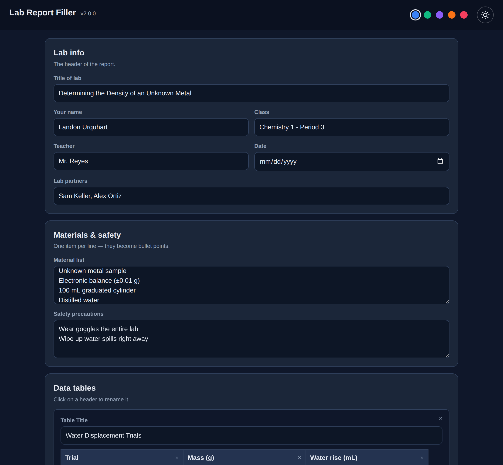
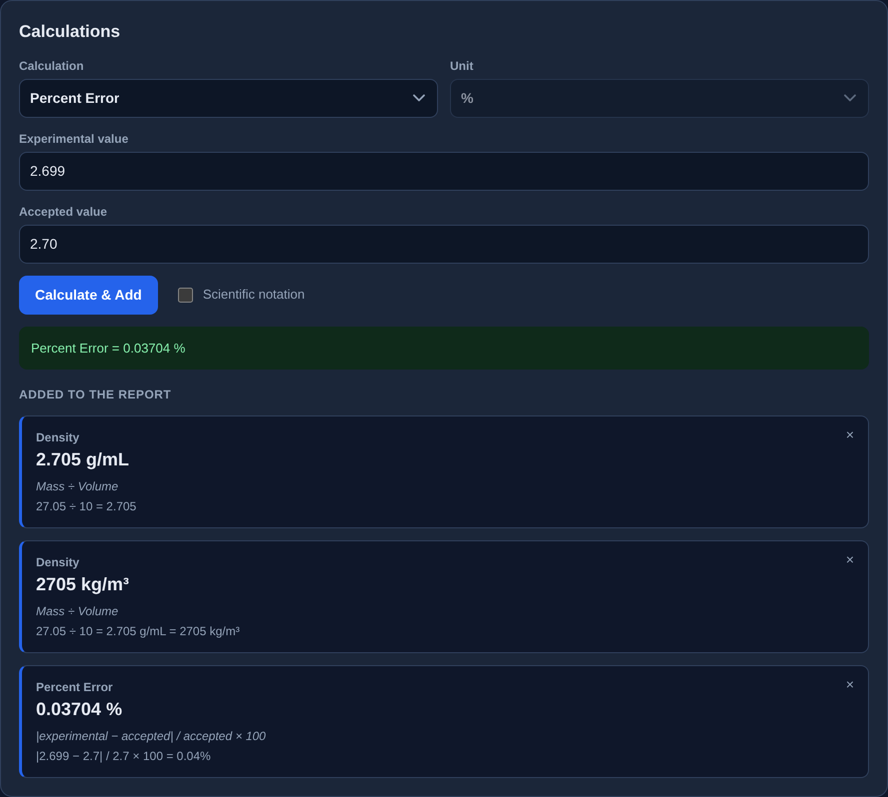
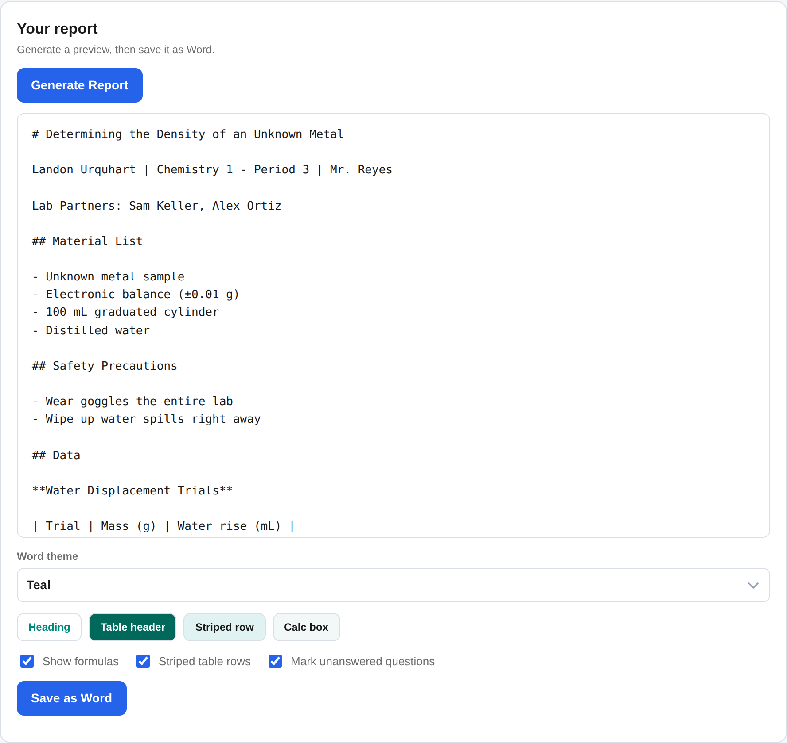
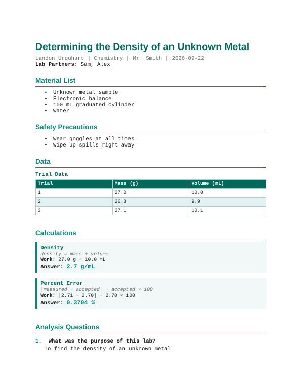

# Lab Report Filler

A desktop app for writing chemistry lab reports. Fill in the form, let it
do the math and show the work, and save a finished Word document you can
turn in.

Mac, Windows and Linux. No account, no sign-in. Nothing you type ever
leaves your computer.



## Install

Go to the
[Releases page](https://github.com/Foxie9190/lab-report-filler/releases)
and download the file for your computer under **Assets**.

**macOS** — the `.dmg`. Open it and drag **Lab Report Filler** into your
Applications folder. **The first time only:** right-click the app and
choose **Open**, then **Open** again. One file covers both Apple Silicon
and Intel Macs.

**Windows** — the `.exe` installer. Click **More info** then **Run
anyway** when the blue box appears.

**Linux** — the `.AppImage` runs anywhere (`chmod +x` it first). On
Debian or Ubuntu the `.deb` installs it properly:
`sudo dpkg -i lab-report-filler_2.0.0_amd64.deb`.

Both warnings above are because the app isn't signed with a paid
developer certificate. Nothing is wrong with the download.

## What it makes

Every report follows the same five-part template:

1. **Title of lab** — plus your name, class, teacher, date and lab partners
2. **Material list**
3. **Safety precautions**
4. **Data tables** — as many tables, rows and columns as you need
5. **Analysis questions** — the questions off the lab sheet with your answers

Calculations sit between the data and the questions. Each one prints the
formula, the numbers plugged in, and the answer with its unit, so it
reads like you worked it out by hand.

## Using it

Work top to bottom. Nothing is required — any section you leave blank is
left out of the report.

**Lab info** — title, name, class, teacher, date, partners.

**Materials & safety** — one item per line. They become bullet points.

**Data tables** — click a header to rename it. *Add Row* and *Add Column*
do what they say, and the × on a row, column or table deletes it. If one
lab needs more than one table, hit *Add Table* — each gets its own name
and prints separately.

**Calculations** — pick one from the dropdown, type the numbers, choose a
unit, and hit *Calculate & Add*. Everything you add is listed underneath
with its formula and work, and each one has an × if you change your mind.



Built in: percent error, percent yield, density, moles from grams,
molarity and average. **Average** works differently — you add one value
at a time, each locks in as a chip, and then you calculate, so you can
check every number before it counts.

The **Unit** dropdown converts for you. Density in `kg/m³` instead of
`g/mL` shows both in the work, so the conversion is visible rather than
magic.

Tick **Scientific notation** before calculating and that answer prints as
`6.022 × 10²³` instead of `6.022e+23`, with the work rewritten to match.
It's per calculation, so one report can have Avogadro's number in
scientific notation and a density as plain `8 g/mL`.

**Analysis questions** — a question box and an answer box per row. *Add
Question* for more.

**Your report** — *Generate Report* shows a preview, then **Save as
Word** writes the `.docx` wherever you choose.



## Word export

The Word file is a real document, not exported text: a coloured title,
section headings, a proper data table with a shaded header, boxed
calculations and numbered questions. Open it in Word, Pages or Google
Docs.



Pick a look from the **Word theme** dropdown:

| Theme | Feel |
|---|---|
| Teal | The default. |
| Navy | Classic, safe for any teacher. |
| Crimson | Bold. |
| Forest | Green. |
| Plum | Purple. |
| Slate (print-friendly) | Grey. Costs the least ink. |
| Custom | Any colour you pick. |

**Custom** asks for one colour and works out the rest — the title, the
table header, the striped rows and the calculation boxes. If you pick
something pale, it darkens the parts that carry white text until they're
still readable, so a highlighter yellow can't make your report
unreadable. Four chips under the dropdown preview the real colours before
you save.

Three toggles sit next to it:

- **Show formulas** — the italic formula line under each calculation
- **Striped table rows** — alternate shading in the data table
- **Mark unanswered questions** — prints *(not answered)* where you left
  an answer blank, so you catch it before you submit. Turn it off for a
  clean copy.

## The app itself

**Dark or light**, with the sun/moon button in the corner. The whole
window switches with a circular sweep out from the button.

**Five accent colours** — the dots next to it. Both choices are
remembered next time you open the app.

Rows, tables and questions slide in when added and fade out when deleted.
If your system has "reduce motion" turned on, all of that is skipped.

## Troubleshooting

**"Lab Report Filler can't be opened" / "is damaged"** (Mac) — right-click
the app and choose **Open**, then **Open** again. Or go to **System
Settings → Privacy & Security** and click **Open Anyway**.

**"Windows protected your PC"** — click **More info**, then **Run
anyway**.

**`Permission denied` on the Linux AppImage** — `chmod +x` it.

**Red banner in the app** — bad input, like dividing by zero. The message
says what went wrong.

**A blank answer printed "(not answered)"** — that's the toggle doing its
job. Untick *Mark unanswered questions* before saving.

## Version 1 (Python)

The original app, written in Python with [Flet](https://flet.dev). It
still works and is still here in the repo (`main.py`, `ui/`, `backend/`).
Download it from the
[v1.2.0 release](https://github.com/Foxie9190/lab-report-filler/releases/tag/v1.2.0),
or run it from source:

```bash
pip install -r requirements.txt
python3 main.py desktop
```

It has one thing version 2 doesn't: a **Trigonometry** tab — a scratch
calculator with degrees mode, variables, a function palette and a keypad,
kept separate from the report. It also checks GitHub for newer releases
on launch; version 2 doesn't do that yet.

Version 2 is where new work happens.

---

## For developers

### Version 2 — TypeScript + Tauri

```bash
git clone https://github.com/Foxie9190/lab-report-filler.git
cd lab-report-filler/tauri
npm install
npm run dev          # the UI in a browser tab, instant reload
npm run tauri dev    # the real desktop window
npm run tauri build  # installers in src-tauri/target/release/bundle
npm test             # the backend tests
npm run check        # TypeScript, no build
```

Needs [Node](https://nodejs.org) and [Rust](https://rustup.rs). `npm run
dev` needs neither Rust nor a build step, so it's the one to live in
while working on the interface.

```
tauri/
  index.html            the page shell
  src/
    main.ts             the form and everything you click
    ui.ts               el(), card(), field(), the custom dropdown, animations
    theme.ts            dark / light and the accent colours
    saveFile.ts         the Save dialog and writing the file
    styles.css          all the styling; every colour is a CSS variable
    backend/
      models.ts         the shared data shapes
      chem.ts           the chemistry math
      report.ts         builds the Markdown preview
      exportDocx.ts     builds the Word document and holds the themes
  src-tauri/            the Rust side: window, plugins, permissions
  test.ts               the backend tests
```

The interface and the backend only talk through the types in `models.ts`.
The UI never does math, and the math never touches a button.

### Making it yours

**Add a calculation.** Write a function in `chem.ts` that takes plain
numbers and returns a `CalcResult`, then add one entry to the
`CALCULATIONS` object at the bottom of the file — a label, the field
names and the units. It shows up in the dropdown next launch.
`percentError` is a complete example to copy.

**Add a Word theme.** Add six hex colours to `THEMES` at the top of
`exportDocx.ts`. The dropdown builds itself from that object.

**Change the app's colours.** The `:root` block at the top of
`styles.css`. Dark is the default; light is the `[data-theme="light"]`
block under it.

### Releasing a version

Two apps, two workflows, two tag prefixes — so tagging one never
rebuilds the other.

**Version 2 (Tauri)** — bump the number in all four places
(`tauri/package.json`, `tauri/src-tauri/Cargo.toml`,
`tauri/src-tauri/tauri.conf.json`, and `VERSION` in `tauri/src/main.ts`),
commit, then:

```bash
git tag v2.0.1
git push origin v2.0.1
```

`.github/workflows/tauri.yml` builds the Mac, Windows and Linux
installers on GitHub's machines and puts them in a **draft** Release.
Check it, then publish.

**Version 1 (Python)** — bump `VERSION` in `backend/updates.py` and the
version in `pyproject.toml`, commit, then:

```bash
git tag py-v1.2.1
git push origin py-v1.2.1
```

`.github/workflows/build.yml` builds the three Python bundles. Version 1
apps compare their own `VERSION` with the newest release tag to decide
whether to show their update strip, so those numbers have to match.
