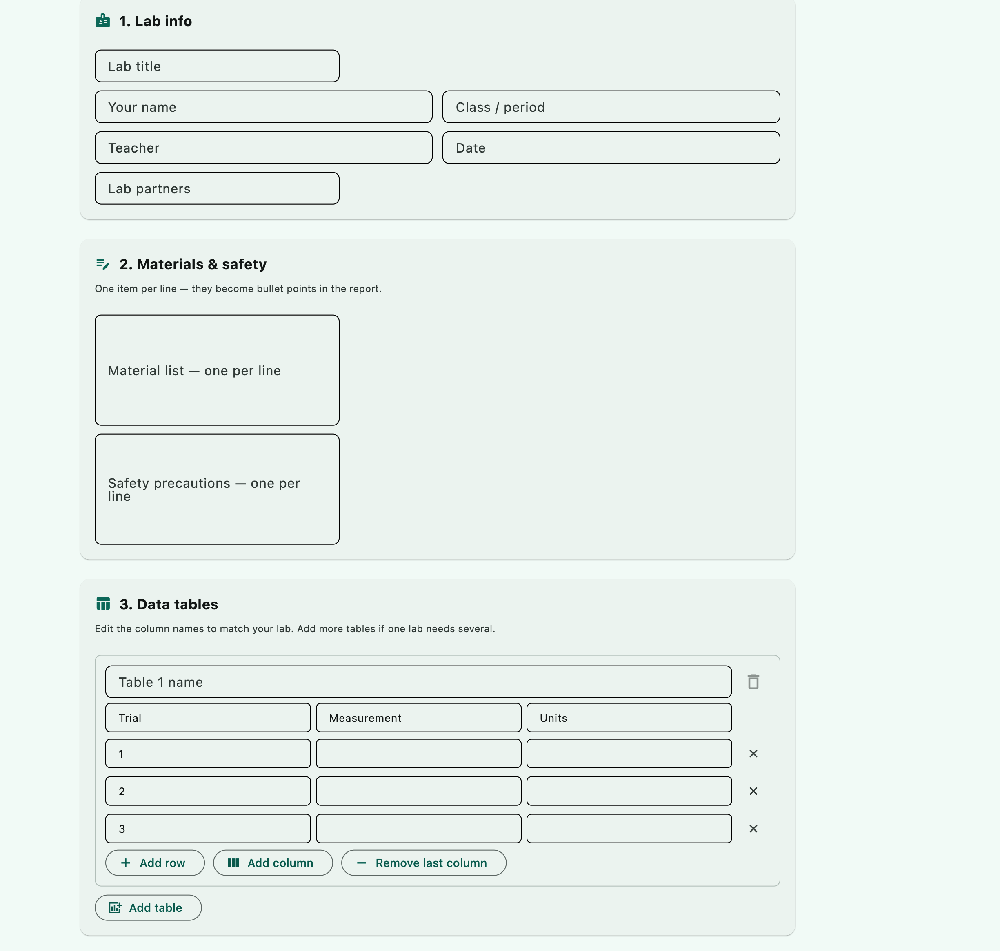

# Lab Report Filler

A Mac and Windows app for writing chemistry lab reports. Fill in the
form, let it do the math and show the work, and get a finished Word
document you can turn in.

No account. Nothing you type leaves your computer. The only time it
touches the internet is a quick check on launch for a newer version — if
there is one, a strip at the top offers a download link. That's all it
does; it never installs anything on its own.

## Install

Go to the
[Releases page](https://github.com/Foxie9190/lab-report-filler/releases)
and scroll down to **Assets**. Download the zip for your computer — *not*
"Source code (zip)" or "Source code (tar.gz)", which GitHub adds
automatically and contain the code, not the app.

Either way, the very first launch takes about twenty seconds while the app
unpacks itself. It looks frozen. It isn't. After that it opens quickly.

### macOS — `Lab-Report-Filler-macOS.zip`

1. Double-click the zip. You get **Lab Report Filler.app** (possibly
   inside a folder of the same name).
2. Drag it into your **Applications** folder.
3. **The first time only:** right-click the app and choose **Open**, then
   click **Open** again in the box that pops up.

That last step matters. The app isn't signed with an Apple developer
certificate, so macOS will say it's from an unidentified developer, or
that it's "damaged," if you just double-click. Right-click → Open tells
your Mac you trust it. After that, it opens normally.

If your Mac still refuses, go to **System Settings → Privacy & Security**,
scroll down, and click **Open Anyway** next to the app's name.

### Windows — `Lab-Report-Filler-Windows.zip`

1. Right-click the zip and choose **Extract All**. You get
   **Lab Report Filler.exe**.
2. Put it wherever you like — the Desktop is fine. There's no installer.
3. Double-click it. The first time, Windows shows a blue **"Windows
   protected your PC"** box: click **More info**, then **Run anyway**.

Same reason as the Mac warning — the app isn't signed with a paid
certificate, so SmartScreen doesn't recognise it yet.

## What it makes

Every report follows the same five-part template:

1. **Title of lab** — plus your name, class, teacher, date, and lab partners
2. **Material list**
3. **Safety precautions**
4. **Data tables** — as many tables, rows and columns as you need
5. **Analysis questions** — the questions off the lab sheet with your answers

Calculations go in between the data and the questions. Each one prints
the formula, the numbers plugged in, and the answer with its unit, so it
reads like you worked it out by hand.



## Using it

Work top to bottom. Nothing is required — any section you leave blank is
simply left out of the report.

**Lab info** — title, name, class, and so on.

**Materials & safety** — one item per line. They become bullet points.

**Data tables** — click a column header to rename it. *Add row*,
*Add column* and *Remove last column* do what they say; the × on a row
deletes it. If one lab needs more than one table, hit *Add table* — each
gets its own name and prints separately in the report.

**Calculations** — pick one from the dropdown, type the numbers, and hit
*Calculate & add*. It shows up below with the work written out. The
**Unit** box fills in on its own, but you can type over it.

Built-in calculations: percent error, percent yield, density, moles from
grams, molarity, and average. *Average* works a little differently: you
add one number at a time, each one locks in as a chip, and then you
calculate. That way you can check every value before it goes in.

**Analysis questions** — a question box and an answer box per row.
*Add question* for more.

**Your report** — hit *Generate report* to see a preview, then
**Save as Word** to get a `.docx`. There's also *Save as .md* if you want
plain text.

## Word export

The Word file is a real document, not exported text: a colored title
band, section headings, a proper data table with a shaded header, boxed
calculations, numbered questions. Open it in Word, Pages, or Google Docs.

Pick a look from the **Word theme** dropdown:

| Theme | Feel |
|---|---|
| Teal | The default. Matches the app. |
| Navy | Classic, safe for any teacher. |
| Crimson | Bold. |
| Forest | Green. |
| Plum | Purple. |
| Slate (print-friendly) | Grey. Costs the least ink. |

Three toggles sit next to it:

- **Show formulas** — the italic formula line under each calculation
- **Striped data rows** — alternate shading in the table
- **Flag unanswered questions** — prints *(not answered)* where you left
  an answer blank, so you catch it before you submit. Turn it off for a
  clean copy.

## Updating

When a new version is out, the app tells you at the top the next time
you open it. Click **Download**, grab the zip from the Releases page,
and replace the old app with the new one — same as installing it the
first time. Your reports aren't stored in the app, so nothing is lost.

## Troubleshooting

**"Lab Report Filler can't be opened" / "is damaged"** (Mac) — see the
macOS steps under Install. Right-click → Open, or *Open Anyway* in
Privacy & Security.

**"Windows protected your PC"** — click **More info**, then **Run
anyway**. Expected on an unsigned app.

**Amber "not built yet" strip** — that calculation isn't finished yet.
The rest of the app works.

**Red strip** — bad input, like dividing by zero. The message says what
went wrong.

**A blank answer printed "(not answered)"** — that's the flag doing its
job. Uncheck *Flag unanswered questions* before saving if you want it
left empty.

**The app won't open and nothing happens** — quit it fully (right-click
its Dock icon → Quit, or ⌘Q) and open it again.

## Status

Working end to end. Two calculations — moles from grams and molarity —
are still being finished and show a "not built yet" notice for now.

---

## For developers

The app is Python, built with [Flet](https://flet.dev). If you want to
run it from source or change it:

```bash
git clone https://github.com/Foxie9190/lab-report-filler.git
cd lab-report-filler
python3 -m venv .venv
source .venv/bin/activate
pip install -r requirements.txt
python3 main.py desktop        # or `python3 main.py` for a browser tab
```

Needs Python 3.11 or newer. The first run takes about twenty seconds
while Flet fetches its runtime.

### Layout

```
main.py                 start here — desktop or browser
ui/
  app.py                every screen, button and box
  theme.py              colors and the card / banner helpers
backend/
  models.py             the shared data shapes the UI and backend agree on
  chem.py               the chemistry math
  report.py             builds the Markdown preview
  export_docx.py        builds the Word document and holds the themes
requirements.txt        flet + python-docx
```

The UI and the backend only talk through the objects in `models.py`. The
UI never reaches into the math, and the math never touches a button.

### Making it yours

**Add a calculation.** Write a function in `chem.py` that takes plain
numbers and returns a `CalcResult`, then add one line to the
`CALCULATIONS` dictionary at the bottom of the file. It appears in the
dropdown next time you start the app. `percent_error` is a complete
example to copy from.

**Add a Word theme.** Add an entry to `THEMES` at the top of
`export_docx.py` — six hex colors. It shows up in the dropdown
automatically.

**Change the app's colors.** `ui/theme.py`, top of the file.

### Releasing a version

Bump `VERSION` in `backend/updates.py`, commit, then tag it with the
same number and push the tag:

```bash
git tag v1.1.0
git push origin v1.1.0
```

GitHub Actions builds the Mac and Windows apps and attaches them to a
Release. Apps already out in the world will see the new tag and show
the update strip. The version and the tag must match — the app compares
them to decide whether to show it.

### Building by hand

```bash
pip install pyinstaller
flet pack main.py --name "Lab Report Filler" --icon assets/icon.icns --add-data "assets:assets" -y
```

The bundle lands in `dist/`. On Windows use `assets/icon.ico` and a
semicolon in `--add-data "assets;assets"`. You can only build for the
platform you're on — GitHub Actions covers the other one.

Icons live in `assets/`: `icon.png` is the master, `icon.icns` is for
macOS and `icon.ico` for Windows. Regenerate the last two from the PNG
if you change it.

**A nicer build, once the tooling is set up.** `flet build macos`
compiles a real native app — your own name and icon in the Dock instead
of Flet's, one process, faster startup. It needs Xcode 15+, CocoaPods
1.16+ and Rosetta 2 on Apple Silicon:

```bash
sudo xcode-select -s /Applications/Xcode.app/Contents/Developer
sudo xcodebuild -runFirstLaunch
sudo softwareupdate --install-rosetta --agree-to-license
brew install cocoapods
```

`pyproject.toml` already has the `[tool.flet]` settings it reads. Switch
the workflow over once a local `flet build macos` succeeds.

**Port already in use** when running from source in browser mode means
an old copy is still running: `kill $(lsof -ti :8550)`. Desktop mode
picks a free port on its own.
