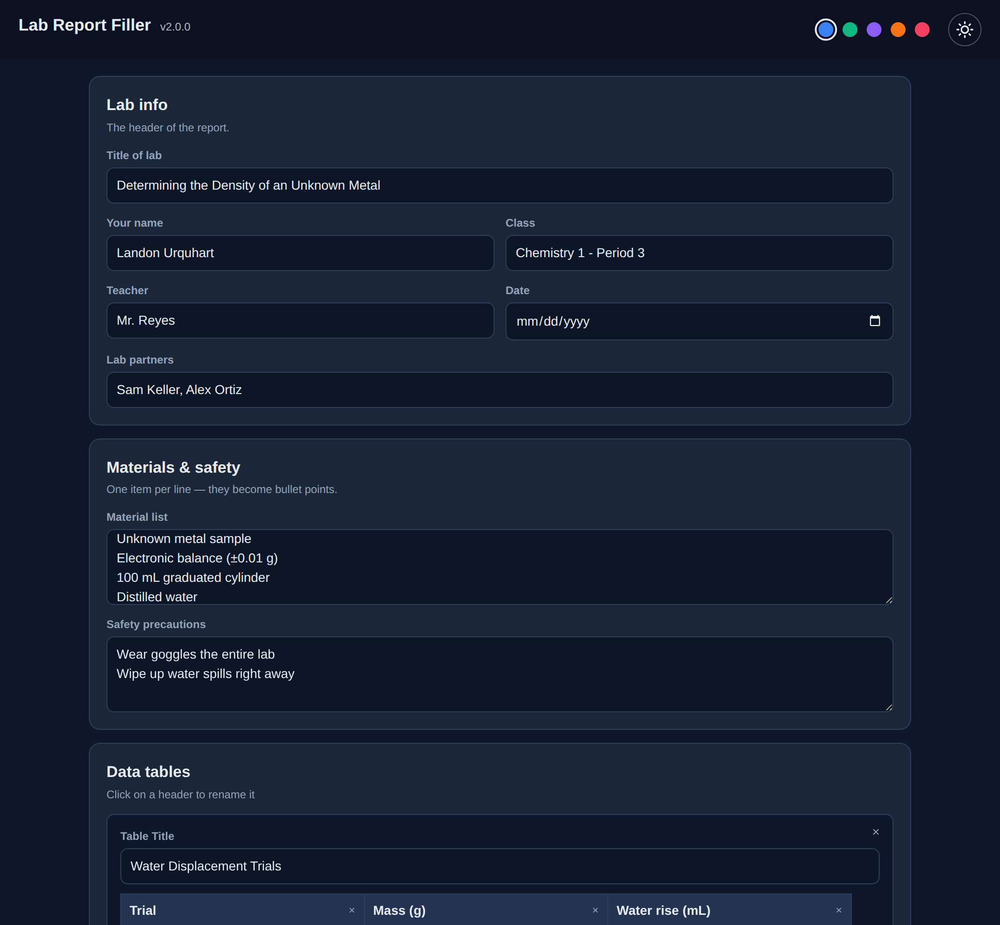
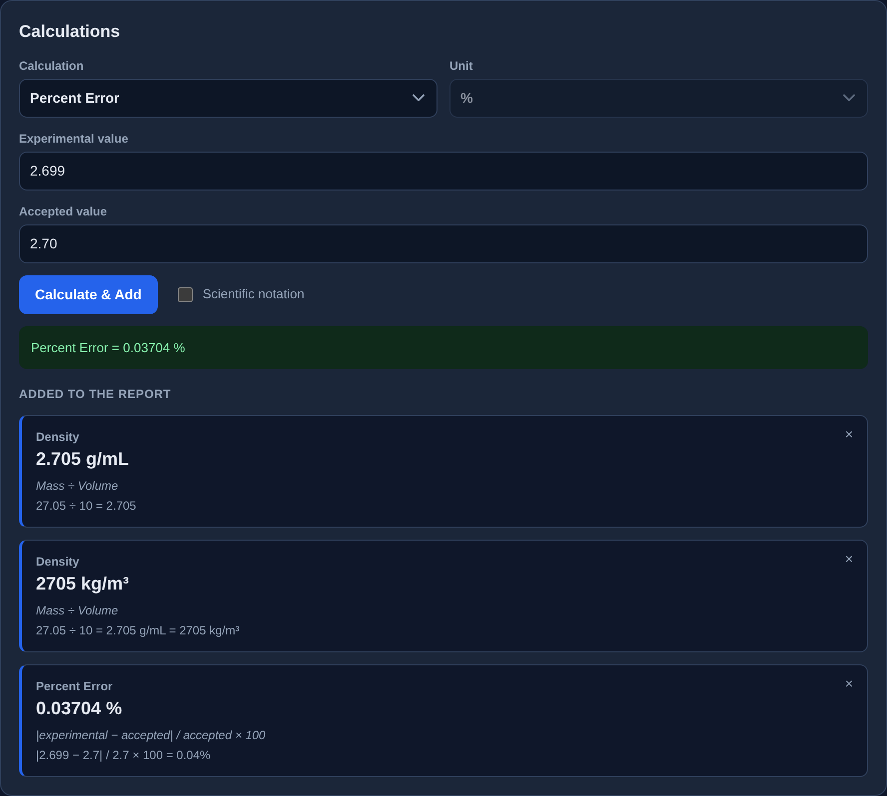
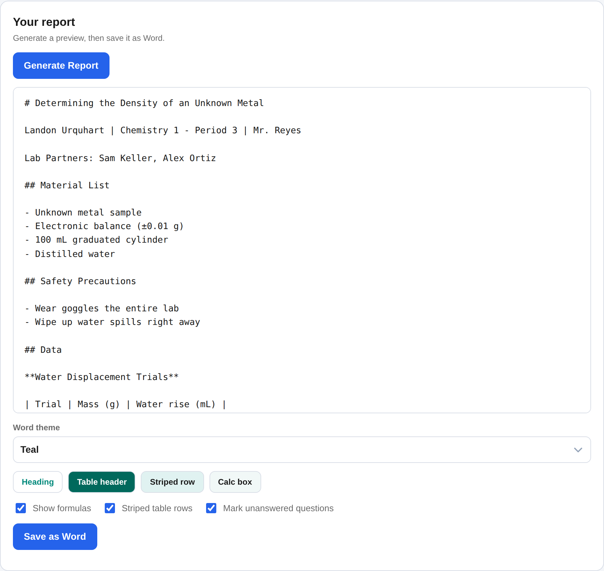
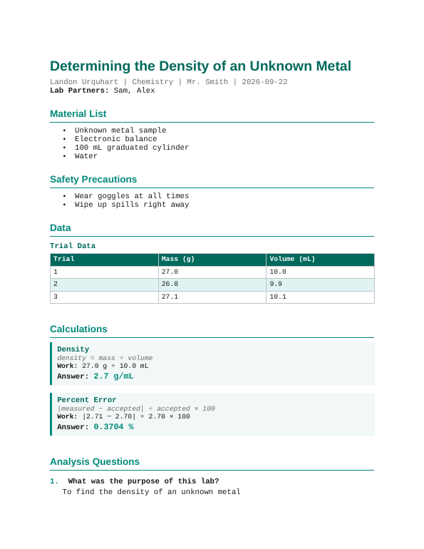

# Lab Report Filler

A schoolwork app with tabs. **Lab report** writes chemistry lab reports —
fill in the form, watch the document build itself on the page beside you,
let it do the math and show the work, and save a finished Word document you
can turn in. **Math** is a calculator and a graph, both running on an
expression engine written from scratch.

Mac, Windows and Linux — or straight in your browser at
**[foxie9190.github.io/lab-report-filler](https://foxie9190.github.io/lab-report-filler/)**,
no install at all.

Accounts are optional. Without one, nothing you type leaves your computer.
With one, your labs follow you to your other computers.



## Install

Go to the
[Releases page](https://github.com/Foxie9190/lab-report-filler/releases)
and download the file for your computer under **Assets**.

**macOS** — the `.dmg`. Open it and drag **Lab Report Filler** into your
Applications folder. **The first time only:** right-click the app and
choose **Open**, then **Open** again. One file covers both Apple Silicon
and Intel Macs.

**Windows** — the `.exe` installer. Click **More info** then **Run
anyway** when the blue box appears.

**Linux** — the `.AppImage` runs anywhere (`chmod +x` it first). On
Debian or Ubuntu the `.deb` installs it properly:
`sudo dpkg -i lab-report-filler_2.0.0_amd64.deb`.

Both warnings above are because the app isn't signed with a paid
developer certificate. Nothing is wrong with the download.

**Or don't install anything** — [the web
version](https://foxie9190.github.io/lab-report-filler/) is the same app
in a browser tab. It writes the same Word file. The difference is where
your labs live: in the browser you're using, rather than in a database the
app can sync. See [The website](#the-website) below.

## What it makes

Every report follows the same five-part template:

1. **Title of lab** — plus your name, class, teacher, date and lab partners
2. **Material list**
3. **Safety precautions**
4. **Data tables** — as many tables, rows and columns as you need
5. **Analysis questions** — the questions off the lab sheet with your answers

Calculations sit between the data and the questions. Each one prints the
formula, the numbers plugged in, and the answer with its unit, so it
reads like you worked it out by hand.

## Using it

Work top to bottom. Nothing is required — any section you leave blank is
left out of the report.

**Lab info** — title, name, class, teacher, date, partners.

**Materials & safety** — one item per line. They become bullet points.

**Data tables** — click a header to rename it. *Add Row* and *Add Column*
do what they say, and the × on a row, column or table deletes it. If one
lab needs more than one table, hit *Add Table* — each gets its own name
and prints separately.

**Calculations** — pick one from the dropdown, type the numbers, choose a
unit, and hit *Calculate & Add*. Everything you add is listed underneath
with its formula and work, and each one has an × if you change your mind.



Built in: percent error, percent yield, density, moles from grams,
molarity and average. **Average** works differently — you add one value
at a time, each locks in as a chip, and then you calculate, so you can
check every number before it counts.

The **Unit** dropdown converts for you. Density in `kg/m³` instead of
`g/mL` shows both in the work, so the conversion is visible rather than
magic.

Tick **Scientific notation** before calculating and that answer prints as
`6.022 × 10²³` instead of `6.022e+23`, with the work rewritten to match.
It's per calculation, so one report can have Avogadro's number in
scientific notation and a density as plain `8 g/mL`.

**Analysis questions** — a question box and an answer box per row. *Add
Question* for more.

**Your report** — pick the look, then **Save as Word** writes the `.docx`
wherever you choose. There's no *Generate* button any more: the page on
the right already is the report.



## The page beside the form

The right-hand half of the report tab is the document itself, on a real
Letter page with one-inch margins, in the colours and font the Word file
uses. It redraws as you type — headings appear as you fill a section in,
a row you add turns up in the table, a calculation lands in its box.

- **Preview** in the tab bar hides and shows it. Drag the line between
  the two halves to give either side more room.
- **Fit** sizes the page to the pane; **−** and **+** zoom by hand.
- Dashed lines mark where Word will start a new page, and the count in
  the corner says how many pages you're handing in. It's an estimate —
  a line sitting right on the boundary can land on either side.
- **Markdown** swaps the page for the plain-text version, for pasting
  into Google Docs or a Canvas box.
- Clicking into a field scrolls the page to that section, so what you're
  typing is what you're watching.

On a narrow window there isn't room for both, so **Preview** flips
between the form and the page instead of splitting the screen.

## Word export

What you see is what saves: the page view and the Word file are built
from the same list of blocks, so they cannot drift apart.

The Word file is a real document, not exported text: a coloured title,
section headings, a proper data table with a shaded header, boxed
calculations and numbered questions. Open it in Word, Pages or Google
Docs.



Pick a look from the **Word theme** dropdown:

| Theme | Feel |
|---|---|
| Teal | The default. |
| Navy | Classic, safe for any teacher. |
| Crimson | Bold. |
| Forest | Green. |
| Plum | Purple. |
| Slate (print-friendly) | Grey. Costs the least ink. |
| Custom | Any colour you pick. |

**Custom** asks for one colour and works out the rest — the title, the
table header, the striped rows and the calculation boxes. If you pick
something pale, it darkens the parts that carry white text until they're
still readable, so a highlighter yellow can't make your report
unreadable. Four chips under the dropdown preview the real colours before
you save, and the page beside the form switches to them as you pick.

Three toggles sit next to it:

- **Show formulas** — the italic formula line under each calculation
- **Striped table rows** — alternate shading in the data table
- **Mark unanswered questions** — prints *(not answered)* where you left
  an answer blank, so you catch it before you submit. Turn it off for a
  clean copy.

## The app itself

**Dark or light**, with the sun/moon button in the corner. The whole
window switches with a circular sweep out from the button.

**Five accent colours** — the dots next to it. Both choices are
remembered next time you open the app.

**Fonts.** Two separate choices, because they're two separate things.
The **Font** dropdown next to the Word theme sets the font of the
*document* — Calibri, Times New Roman, Arial, Georgia, Cambria or Courier
New — and the page beside the form switches to it so you see it before you
save. The dropdown in the header sets the font of the *app* — System,
Serif, Rounded or Mono. Both are remembered, and neither affects the
other.

Rows, tables and questions slide in when added and fade out when deleted.
If your system has "reduce motion" turned on, all of that is skipped.

## Your labs are saved

Everything saves itself as you type — there is no Save button for your
work in progress (*Save as Word* is for handing in). A line in the header
says *Saving…* then *Saved*.

**My labs** in the tab bar lists everything you've written, newest first,
with when you last touched it. Open one to carry on, duplicate one to run
the same experiment again without retyping the setup, or delete one.
Closing the app and opening it again puts you back in the lab you had
open.

In the installed app they live in a SQLite database in the app's own data
folder. In the browser they live in that browser.

## Accounts and sync

Optional, and off until you ask for it — the button says **Sign in** in
the corner of the header.

With an account your labs are kept on a server as well as on your
computer, so the same labs are there on a different one. It syncs when you
sign in and whenever you press **Sync now**: your changes go up, anything
new comes down, and if the same lab was edited in two places the newer
edit wins.

Without an account nothing is sent anywhere, and the app behaves exactly
as it did before accounts existed.

The server is a small Node program in `server/` — see
[server/DEPLOY.md](server/DEPLOY.md) for running your own. Passwords are
stored scrambled with a per-password salt, never as text, and every
request for a lab is tied to the account that asked. If it's been quiet
for a while the first sign-in can take up to a minute while the free
hosting wakes the server up; the app says so rather than looking frozen.

## Updates

The app asks GitHub once a day whether there's a newer release, and if
there is, a strip appears at the top with a link. Dismiss it and that
version stays dismissed. If GitHub can't be reached you see nothing at
all — it never gets in the way, and it never updates anything by itself.

## The website

The same app, built for a browser, published at
[foxie9190.github.io/lab-report-filler](https://foxie9190.github.io/lab-report-filler/)
by `.github/workflows/pages.yml` every time `main` changes.

It's the same code — the browser build just leaves out the two things that
need the installed app:

- **Sync**, which reads the SQLite database a browser tab doesn't have
- **The update strip**, which makes no sense on a page that is always the
  newest version

so labs typed on the website stay in that browser, and the header has a
**Get the app** link instead of the account button.

## Math

A second subject, with its own tabs inside the tab — because a calculator
and a graph want completely different screens.

### Calculator

Laid out like a page of working rather than a pocket calculator: every line
you enter stays on screen with its answer under it, so you can see how you
got somewhere instead of one number in a window.

- **Degrees or Radians**, with the button in the corner. The graph uses the
  same setting, so the two can never disagree about what `sin(90)` means.
- **Variables** — `x = 5`, then `x^2 + 1`. What you've set is listed under
  the working, and clicking one forgets it.
- **`ans`** is the last answer, so `ans / 2` carries on from the line above.
- **The keys** under the box type for you and put the cursor inside the
  brackets: `√`, `x²`, `π`, `sin`, `log` and the rest.
- **↑** brings back the last thing you typed.
- Anything wrong says so on the line that caused it — `1/0` answers *Can't
  divide by zero*, not `Infinity`.

Built in: `sqrt`, `abs`, `round`, `floor`, `ceil`, `ln`, `log`, `sin`,
`cos`, `tan`, `asin`, `acos`, `atan`, `min`, `max`, plus `pi` and `e`.

### Graph

Type `y = x^2 - 3` and it's drawn. Add as many lines as you like; each gets
its own colour.

- **Drag** to move, **scroll** to zoom in on wherever the pointer is, or use
  **+ − Reset**. Hovering says what `x` and `y` are under the pointer.
- Anything the calculator knows works here: set `a = 2` in the calculator
  and you can draw `a*x^2`.
- `sqrt(x)` simply stops at zero rather than drawing nonsense, and `1/x`
  doesn't get a fake vertical line through the break at zero — a gap in a
  function is drawn as a gap.

### How it works, and why there's no `eval`

The obvious way to turn `2 + 3 * 4` into 14 is to hand it to `eval()`. The
app never does, because `eval` runs whatever it's given *as code* — one
typed line could reach anything the app can.

Instead `src/backend/math` does it properly, in three steps:

```
"2 + 3 * 4"  ──tokenize──▶  2 + 3 * 4  ──parse──▶    +     ──evaluate──▶  14
                            (pieces)                / \
                                                   2   *
                                                      / \
                                                     3   4
```

1. **tokenize.ts** chops the text into pieces: numbers, names, operators.
   No maths, no meaning.
2. **parse.ts** builds a tree. One function per level of precedence —
   `+ −`, then `* /`, then `^`, then the smallest pieces — each asking the
   level below it for its parts. That nesting *is* the precedence; there's
   no table of priorities anywhere. `^` leans right (`2^3^2` is 512) because
   it calls itself instead of looping.
3. **evaluate.ts** walks the tree and returns a number. A `NaN` or an
   `Infinity` is caught where it appears rather than being allowed to spread
   — which is what keeps the graph honest.

The engine is covered by three test files: `npm run test:math`,
`npm run test:parse`, `npm run test:eval`.

## Troubleshooting

**"Lab Report Filler can't be opened" / "is damaged"** (Mac) — right-click
the app and choose **Open**, then **Open** again. Or go to **System
Settings → Privacy & Security** and click **Open Anyway**.

**"Windows protected your PC"** — click **More info**, then **Run
anyway**.

**`Permission denied` on the Linux AppImage** — `chmod +x` it.

**Red banner in the app** — bad input, like dividing by zero. The message
says what went wrong.

**A blank answer printed "(not answered)"** — that's the toggle doing its
job. Untick *Mark unanswered questions* before saving.

**"Can't reach the server"** when signing in — the sync server is asleep or
down. Your labs are safe on your computer either way; sync catches up next
time it answers.

**"Sync works in the installed app, not the browser preview"** — exactly
that. The web version keeps labs in your browser; sync needs the installed
app.

## Version 1 (Python)

The original app, written in Python with [Flet](https://flet.dev). It
still works and is still here in the repo (`main.py`, `ui/`, `backend/`).
Download it from the
[v1.2.0 release](https://github.com/Foxie9190/lab-report-filler/releases/tag/v1.2.0),
or run it from source:

```bash
pip install -r requirements.txt
python3 main.py desktop
```

Its **Trigonometry** tab was the ancestor of the Math tab above — the same
idea, one screen instead of several, and the expression engine rewritten
from scratch in TypeScript.

Version 2 is where new work happens.

---

## For developers

### Version 2 — TypeScript + Tauri

```bash
git clone https://github.com/Foxie9190/lab-report-filler.git
cd lab-report-filler/tauri
npm install
npm run dev          # the UI in a browser tab, instant reload
npm run tauri dev    # the real desktop window
npm run tauri build  # installers in src-tauri/target/release/bundle
npm run build        # the website build, into dist/
npm test             # the chemistry tests
npm run test:math    # the math tokenizer
npm run test:parse   # the math parser
npm run test:eval    # the math evaluator
npm run check        # TypeScript, no build
```

Needs [Node](https://nodejs.org) and [Rust](https://rustup.rs). `npm run
dev` needs neither Rust nor a build step, so it's the one to live in
while working on the interface.

```
tauri/
  index.html            the page shell
  public/icon.png       the website's favicon
  src/
    main.ts             the form and everything you click
    preview.ts          draws the live page: Block[] -> HTML
    ui.ts               el(), card(), field(), the custom dropdown, animations
    theme.ts            dark / light, accent colours, the app's font
    store.ts            saving: SQLite in the app, localStorage in a browser
    cloud.ts            the API client and the sync routine
    account.ts          the sign-in pop-out
    updateBar.ts        the "there's a new version" strip
    saveFile.ts         the Save dialog and writing the file
    styles.css          all the styling; every colour is a CSS variable
    math/
      mathTab.ts        the Math tab shell and its inner tabs
      calculator.ts     the calculator screen
      graph.ts          the graph screen: axes, curves, pan and zoom
    backend/
      models.ts         the shared data shapes, including Block
      chem.ts           the chemistry math
      db.ts             the SQLite schema and every query
      document.ts       LabReport -> Block[]: what goes in the report
      report.ts         builds the Markdown preview
      exportDocx.ts     builds the Word document, the themes and the fonts
      updates.ts        asks GitHub for the newest release
      math/
        tokenize.ts     text -> tokens
        parse.ts        tokens -> a tree
        evaluate.ts     a tree -> a number
  src-tauri/            the Rust side: window, plugins, permissions
  test.ts               the chemistry tests
  test-math.ts          the tokenizer tests
  test-parse.ts         the parser tests
  test-eval.ts          the evaluator tests

server/                 the accounts and sync API (Node, Express, MongoDB)
  src/server.ts         the routes
  src/auth.ts           signing up, signing in, sessions
  src/labs.ts           reading and writing labs, always filtered by account
  src/db.ts             the MongoDB connection and its indexes
  DEPLOY.md             how to host it
```

The interface and the backend only talk through the types in `models.ts`.
The UI never does math, and the math never touches a button.

`document.ts` is the one place that knows what belongs in a report and in
what order. Everything that draws the report reads its `Block[]` rather
than the `LabReport` itself, which is why the live page and the Word file
agree. If a rule about the report changes, it changes there, once.

### Making it yours

**Add a calculation.** Write a function in `chem.ts` that takes plain
numbers and returns a `CalcResult`, then add one entry to the
`CALCULATIONS` object at the bottom of the file — a label, the field
names and the units. It shows up in the dropdown next launch.
`percentError` is a complete example to copy.

**Add a Word theme.** Add six hex colours to `THEMES` at the top of
`exportDocx.ts`. The dropdown builds itself from that object.

**Change the app's colours.** The `:root` block at the top of
`styles.css`. Dark is the default; light is the `[data-theme="light"]`
block under it.

**Add a maths function.** One line in `FUNCTIONS` at the top of
`evaluate.ts` — a name, how many numbers it takes, and what it does. The
calculator lists what's available from that same object, so it appears in
the help line by itself.

**Add an area to the Math tab.** Write a module exporting
`build(host, shared)`, then add it to `AREAS` in `math/mathTab.ts`. It gets
the shared `env`, so variables set in the calculator are available in it.

### Releasing a version

Two apps, two workflows, two tag prefixes — so tagging one never
rebuilds the other.

**Version 2 (Tauri)** — bump the number in all four places
(`tauri/package.json`, `tauri/src-tauri/Cargo.toml`,
`tauri/src-tauri/tauri.conf.json`, and `VERSION` in
`tauri/src/backend/updates.ts`), commit, then:

```bash
git tag v2.0.1
git push origin v2.0.1
```

`.github/workflows/tauri.yml` builds the Mac, Windows and Linux
installers on GitHub's machines and puts them in a **draft** Release.
Check it, then publish.

**Version 1 (Python)** — bump `VERSION` in `backend/updates.py` and the
version in `pyproject.toml`, commit, then:

```bash
git tag py-v1.2.1
git push origin py-v1.2.1
```

`.github/workflows/build.yml` builds the three Python bundles. Version 1
apps compare their own `VERSION` with the newest release tag to decide
whether to show their update strip, so those numbers have to match.

**The website** needs no tag. `.github/workflows/pages.yml` rebuilds and
republishes it on every push to `main`. It has to be switched on once, in
**Settings → Pages → Source: GitHub Actions** — the workflow isn't allowed
to do that itself.

**The server** redeploys itself when `main` changes, if you've connected
the repo to a host. `server/DEPLOY.md` has the setup, and
`tauri/.env.production` holds the address the built app talks to — change
that line if the server moves.
